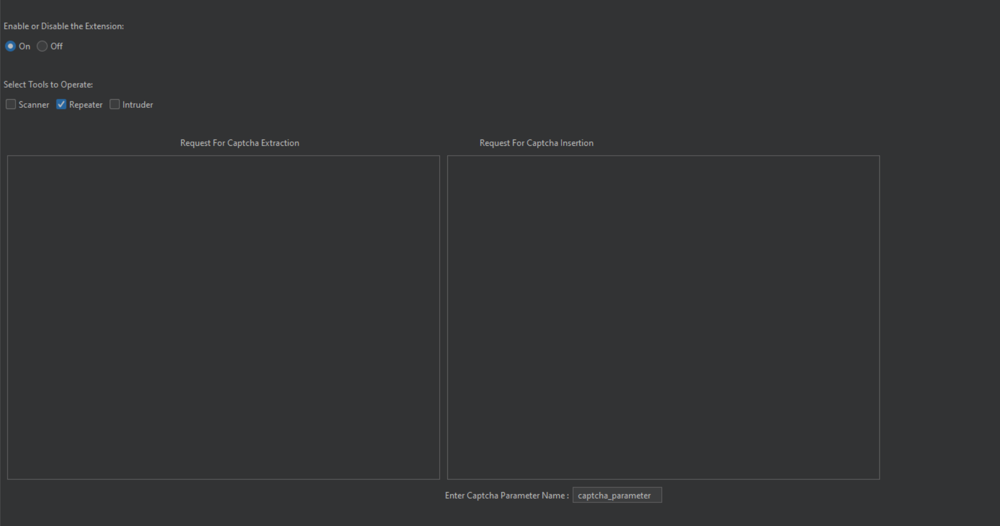
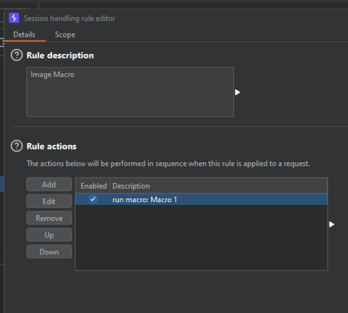
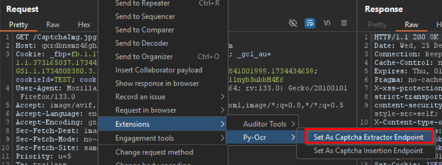
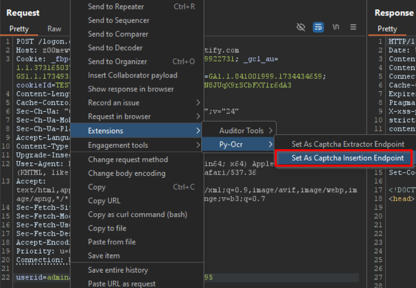
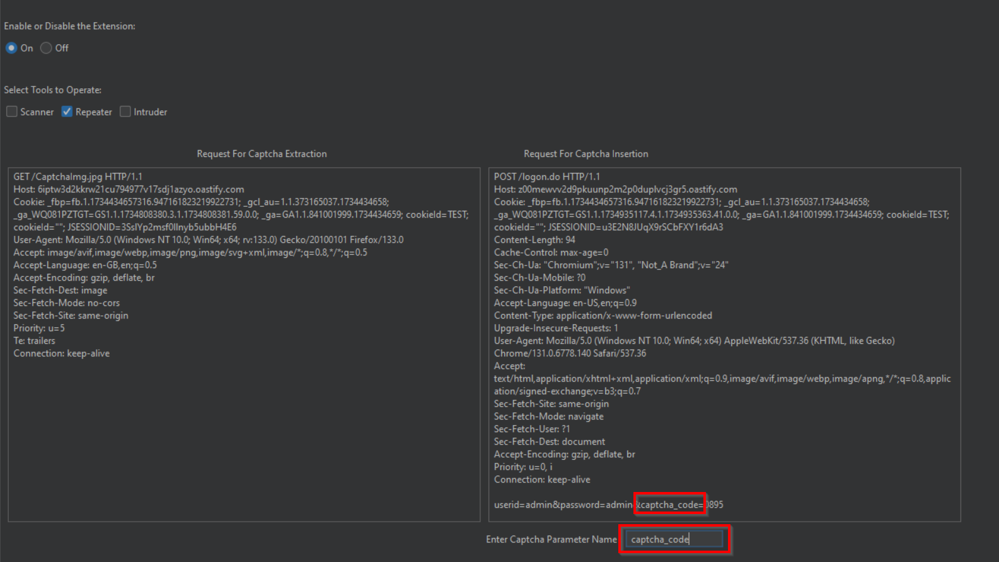
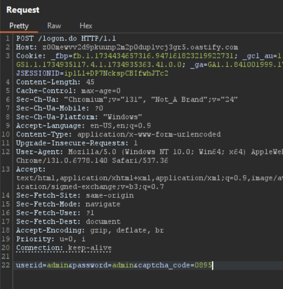
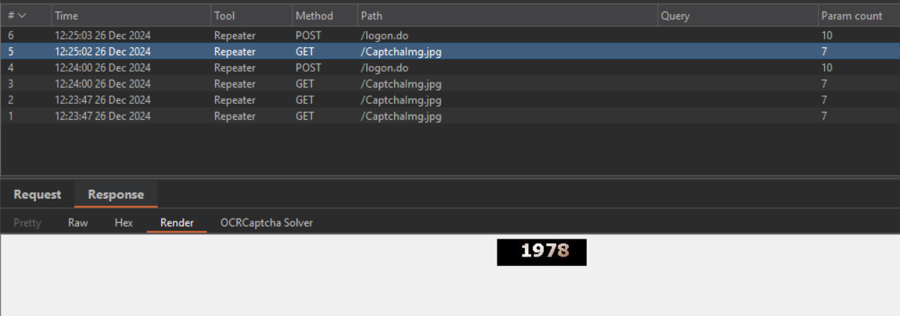
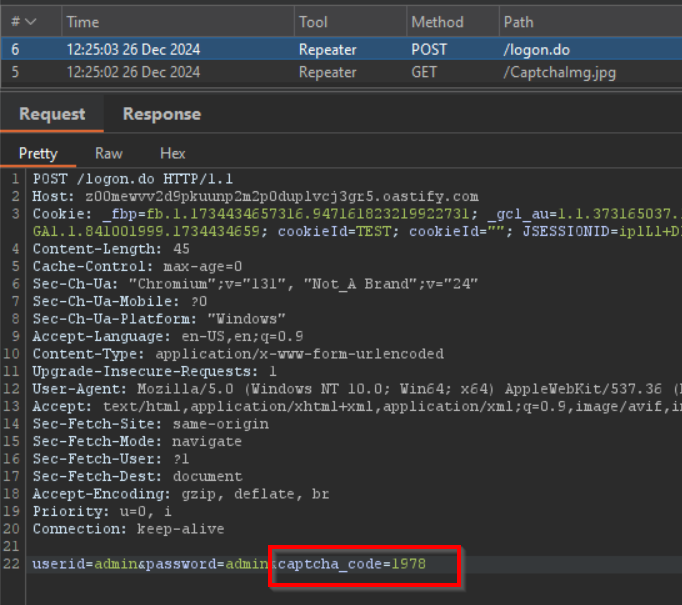

## Description
OCRCaptcha Solver is a Burp Suite extension that automates captcha handling by extracting captcha images from HTTP requests, converting them to text using OCR (Optical Character Recognition), and seamlessly injecting the resolved captcha value into the request parameters. It streamlines testing workflows by eliminating the need for manual captcha entry. 
In short OCRCaptcha Solver is a Burp Suite extension that leverages Tesseract OCR to decode CAPTCHA images and automatically populate the extracted text into requests, streamlining the testing process for applications with CAPTCHA challenges.

## Note
The OCRCaptcha Solver may not be able to convert all types of CAPTCHA images to text, as it relies on Tesseract for OCR functionality. To ensure compatibility with a wider range of CAPTCHA types, keep Tesseract updated to the latest version.


## Installation Process

Follow these steps to install and set up the OCRCaptcha Solver tool:

1. **Clone the Repository**  
   Run the following command to clone the repository:  
   ```bash
   git clone https://github.com/Parimal-shaw/OCRCaptcha-Solver.git
2. **Download Tesseract**
    Visit [Tesseract-OCR](https://github.com/tesseract-ocr/tesseract) and download the latest version of Tesseract.
3. **Set Environment Variable for Tesseract**
    Add the path of **tesseract.exe** to your system's environment variables. Verify the installation by running the following command in the terminal:
    ```bash
    tesseract -h
4. **Install the Burp Suite Extension**

    Open Burp Suite and navigate to the Extensions tab.
    Click on Add and select the OCRCaptcha Solver.exe file.
    The extension will be installed and ready to use.


## Usage

Follow these steps to use the OCRCaptcha Solver tool:

1. **Activate the Extension**  
   - Go to the extension in Burp Suite.  
   - Click **ON** and select an operation mode from **Intruder**, **Repeater**, or **Scanner**.
    

2. **Set a Macro for the CAPTCHA Image Request**  
   - Configure a macro for the CAPTCHA image request endpoint in Burp Suite.
    

3. **Set the CAPTCHA Extraction Endpoint**  
   - Navigate to the CAPTCHA image request.  
   - Right-click on the request, then go to **Extension > OCRCaptcha Solver** and click **Set as Captcha Extractor Endpoint**.
   

4. **Set the CAPTCHA Insertion Endpoint**  
   - Navigate to the request where the CAPTCHA value needs to be submitted.  
   - Right-click on the request, then go to **Extension > OCRCaptcha Solver** and click **Set as Captcha Insertion Endpoint**.
   

5. **Configure the CAPTCHA Parameter Name**  
   - Open the OCRCaptcha Solver extension.  
   - Set the parameter name where the CAPTCHA value should be inserted.
   

6. **Send the Request**  
   - Use **Intruder**, **Scanner**, or **Repeater** to send the request.  
   - The tool will automatically fetch the CAPTCHA image, decode it, and insert the value into the actual request.
    
    
    

## Contributing

Contributions are welcome! If you encounter any issues or have suggestions for improvement, feel free to open an issue or submit a pull request.

## Acknowledgments

- Thanks to the [Tesseract OCR](https://github.com/tesseract-ocr/tesseract) team for providing an excellent and easy to use OCR engine.
- Inspired by the need to streamline CAPTCHA handling during web application security testing.

## Disclaimer

This tool is intended for ethical use only. Ensure you have proper authorization before using it to test any application.